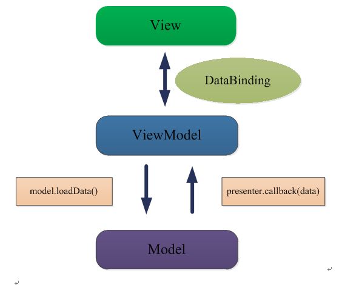
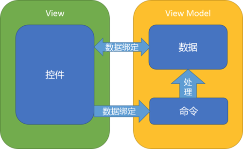

## MVVM

- View: 对应于Activity和XML，负责View的绘制以及与用户的交互。
- ViewModel: 负责完成View与Model间的交互，负责业务逻辑。
- Model: 实体模型（数据的获取、存储、数据状态变化）

MVVM的目标和思想与MVP类似，利用数据绑定(Data Binding)、依赖属性(Dependency Property)、命令(Command)、路由事件(Routed Event)等新特性，打造了一个更加灵活高效的架构。

## 弊端 ##
- 数据绑定使得 Bug 很难被调试，错误位置难定位
- 数据双向绑定不利于代码重用。客户端开发最常用的重用是View，但是数据双向绑定技术，让你在一个View都绑定了一个model，不同模块的model都不同，那就不能简单重用View了。 

## Libraries
- [PermissionsDispatcher](https://github.com/hotchemi/PermissionsDispatcher)
- [KLog](https://github.com/ZhaoKaiQiang/KLog)
- [FastJson](https://github.com/alibaba/fastjson)
- [EventBus](https://github.com/greenrobot/EventBus)
- [Fresco](https://github.com/facebook/fresco)
- [LRecyclerView](https://github.com/jdsjlzx/LRecyclerView)
- [RxBinding](https://github.com/JakeWharton/RxBinding)
- [RxJava2](https://github.com/ReactiveX/RxJava)
- [Retrofit](https://github.com/square/retrofit)
- [Leakcanary](https://github.com/square/leakcanary)
- [AndroidAutoLayout](https://github.com/hongyangAndroid/AndroidAutoLayout)
- [PageStateManager](https://github.com/hss01248/PageStateManager)

## Thanks
- [Data Binding Library | Android Developers](https://developer.android.com/topic/libraries/data-binding/index.html) 需要翻墙
- [如何构建Android MVVM 应用框架](http://tech.meituan.com/android_mvvm.html)

## License
   Apache-2.0
